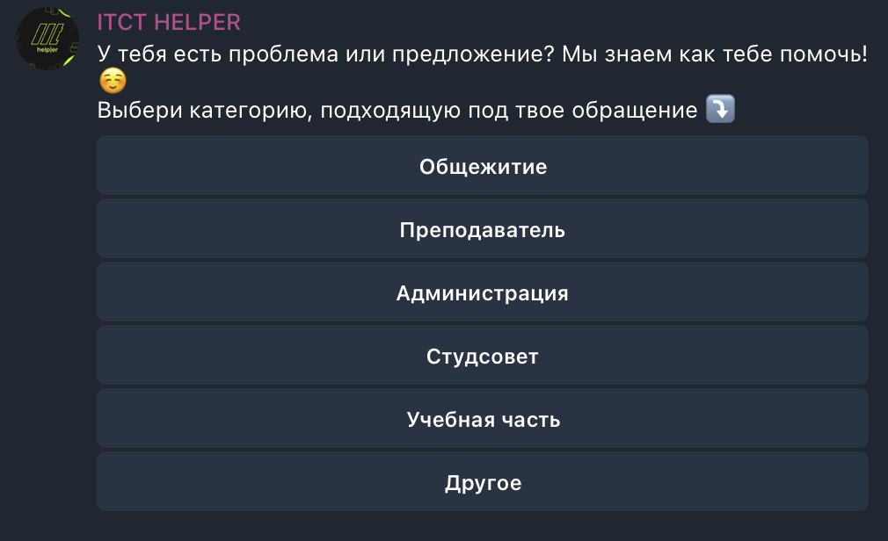

# octo-bot

Телеграм-бот, разработанный для моего института, помогающий студентам с ответами на часто задаваемые вопросы и предоставлением обратной связи. Бот интегрирован с Google Drive и Google Docs для хранения медиафайлов и управления обратной связью


---

## Содержание
- [Особенности](#особенности)
- [Используемые технологии](#используемые-технологии)
- [Установка](#установка)
- [Хост](#хостинг)
- [Использование](#использование)

---

## Особенности

- **Система FAQ**: Отображает вопросы и дает ответы исходя из JSON файла.
- **Инлайн кнопки**: Удобное взаимодействие с пользователем через инлайн кнопки.
- **Многоуровневое меню**: Организует ответы и опции в вложенной структуре для простоты навигации.
- **Система обратной связи**: Собирает обратную связь от пользователей, включая медиафайлы, и загружает их на Google Drive.
- **Интеграция с Google Docs**: Автоматически добавляет собранную обратную связь в Google Document для хранения.

## Используемые технологии

- **Python**: Основной язык для разработки бота.
- **aiogram**: Современный и быстрый фреймворк для Telegram-ботов.
- **Google APIs**: Google Drive и Google Docs для хранения и управления медиафайлами и документами.
- **JSON**: Для хранения вопросов и ответов в структурированном формате.

## Установка

1. Клонирование репозитория:

```bash
git clone https://github.com/neklyudovv/octo-bot.git
cd octo-bot
```

2. Установка всех необходимых зависимостей:

```bash
pip3 install -r requirements.txt
```

3. Настройка учетных данных для Google API:
   - Перейдите в [Google Developer Console](https://console.developers.google.com/).
   - Создайте проект и включите API для Google Drive и Google Docs.
   - Скачайте JSON файл с учетными данными и сохраните его как `credentials.json` в директории проекта.

4. Настройка бота:
   - Активируйте виртуальную среду, и в ```.env``` файле передайте TOKEN

5. Запустите бота:

```bash
python3 main.py
```

## Хостинг

Бот хостится и доступен по ссылке: [@itcthelperbot](https://t.me/itcthelperbot).

## Использование

- **FAQ**: Бот будет отвечать на вопросы, используя заранее подготовленный JSON файл.
- **Обратная связь**: Пользователи могут отправлять обратную связь, включая медиафайлы, которые будут загружены на Google Drive и добавлены в Google Docs.

## Пример

- Пользователь выбирает нужный вопрос, и бот отвечает на основе заранее подготовленного ответа.
- Если пользователь отправляет обратную связь с медиафайлом, бот загружает его на Google Drive и добавляет в общий документ Google Docs.